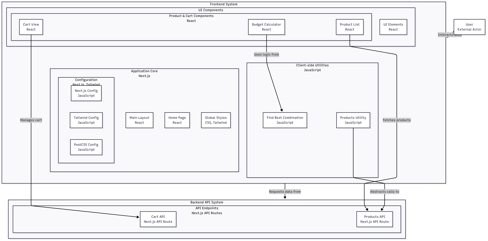

# 🛒 Prueba Técnica – API y Carrito de Compras (Next.js 14 + Bun.js)

Este proyecto es mi propuesta de solución para la prueba técnica de HoyTrabajas. Desarrollé una API sencilla para gestionar productos y un carrito de compras, junto con un frontend que interactúa con ella. Además, incluye una función que calcula la mejor combinación de productos según un presupuesto máximo.

## 📓 Proceso de creacion Notion
https://www.notion.so/Prueba-tecnica-HoyTrabajas-24a5a85f3559808a91b9c2e850cb11e8?source=copy_link

## 🚀 Tecnologías utilizadas

* **Next.js 14 (App Router)** → API y frontend en un solo proyecto.
* **React** → Componentes y UI.
* **JavaScript** → Desarrollo ágil.
* **Bun.js** → Gestor y runtime rápido (compatible con npm y pnpm).
* **Vercel** → Deploy rápido y sin configuración extra.

## 📌 Decisiones técnicas

* **Carrito en memoria**, sin base de datos (se reinicia al apagar el servidor).
* **SSR** para carga inicial de productos.
* **Código modular** con separación de lógica y UI.

## 📂 Estructura

```
├── README.md
├── src
│   ├── app
│   │   ├── api
│   │   │   ├── cart/route.js
│   │   │   └── products/route.js
│   │   ├── globals.css
│   │   ├── layout.jsx
│   │   └── page.jsx
│   ├── components
│   │   ├── BudgetCalculator.jsx
│   │   ├── CartView.jsx
│   │   ├── ProductList.jsx
│   │   └── ui.jsx
│   └── lib
│       ├── findBestCombination.js
│       └── products.js
```

## 🧮 Funcionalidades

**Backend (API)**

* `GET /api/products` → Lista estática de productos.
* `POST /api/cart` → Añade un producto al carrito por `productId`.
* `GET /api/cart` → Devuelve el carrito actual.
* CRUD básico para manipular productos en el carrito.

**Frontend**

* Lista de productos obtenida desde la API.
* Botón **Agregar al carrito**.
* Vista del carrito con total calculado.
* Calculadora para mejor combinación de productos sin exceder presupuesto.

**Lógica – `findBestCombination`**

* Entrada: lista de productos y presupuesto.
* Salida: combinación óptima sin superar el presupuesto.
* Ejemplo: presupuesto = 150 → \[Producto 1 (60), Producto 4 (70)] con total 130.

## 📊 Diagrama de flujo



## 🖥️ Instalación y ejecución

```bash
git clone https://github.com/JeissonWeeDev/prueba-tecnica-hoytrabajas

cd prueba-tecnica-hoytrabajas

bun install # o npm/pnpm install

bun dev     # o npm run dev / pnpm dev
```

El proyecto estará disponible en `http://localhost:3000`

## 📄 Notas importantes

* No implementé autenticación ni manejo de stock para tener un limite de productos agregados en funcion de su disponibilidad.
* Carrito no persistente al recargar.
* Compatible con Bun, npm, pnpm y yarn.

## ✨ Autor

Jeisson Leon © 2025
